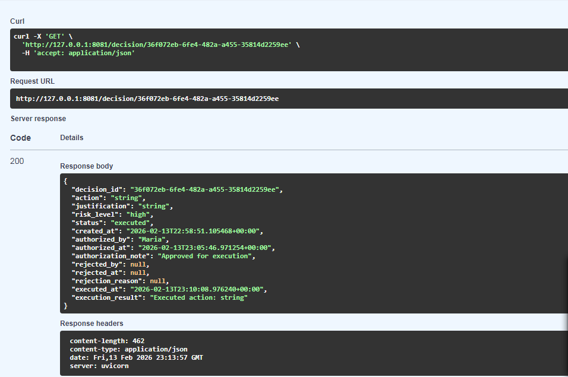
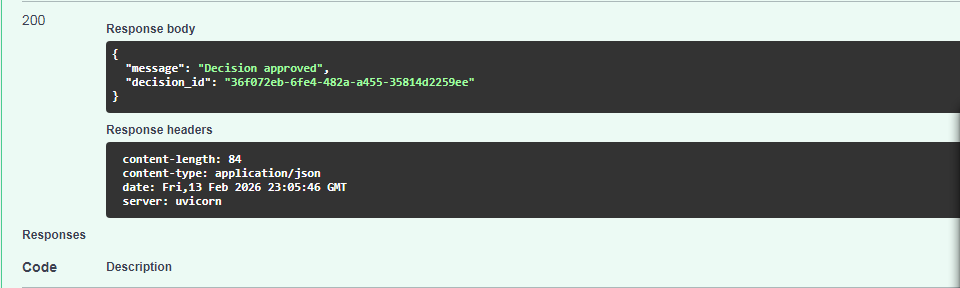
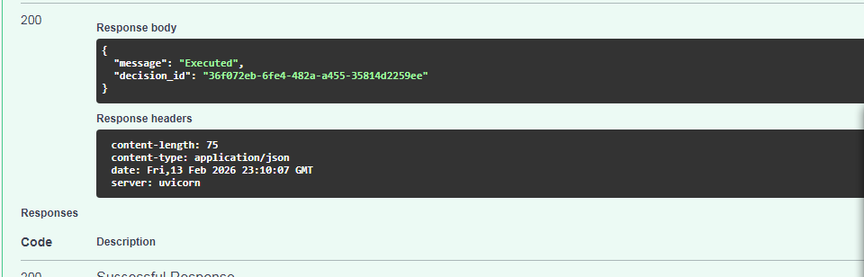

# Responsibility Gate

Pre-execution authority control layer for AI-assisted decisions.

## Core Principle

No high-impact automated decision executes without named human responsibility.

This system enforces a binding rule:
High-risk actions require explicit human authorization before execution.

---

## What It Demonstrates

• Risk-based gating  
• Named authority binding  
• Execution control before action  
• Audit logging with timestamps  

This is not a dashboard.
This is not a compliance checklist.
This is an execution control layer.

---

## Basic Flow

AI → submits decision  
System → classifies risk  
High-risk → status = pending  
Human → authorizes with name  
Only then → execution allowed  

---

